# Screen shots of Postman Results

### POST API for adding a message_1 to message_5 messages-This is screenshot of the fifth message

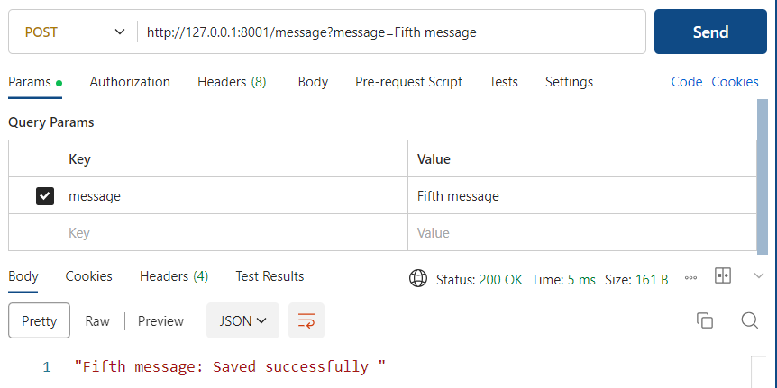

### GET all API to check all added messages

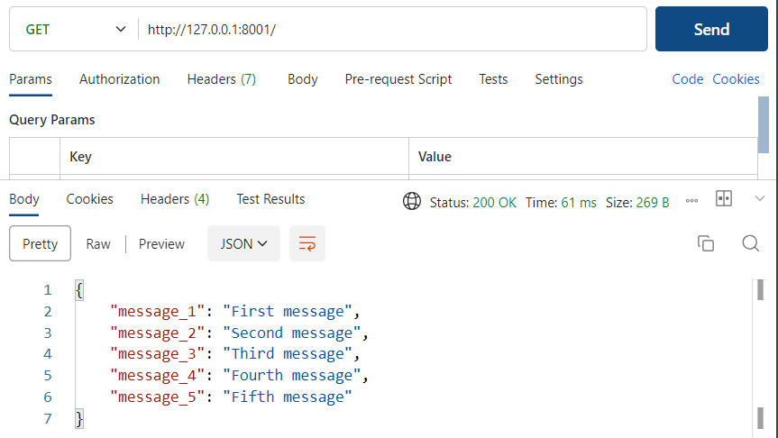

### GET API for a particular message "message_2"

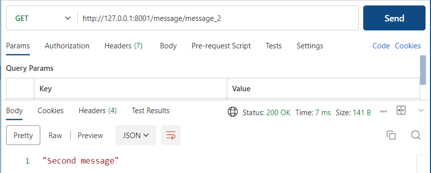

### DELETE API for a particular message

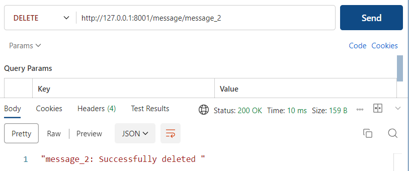

### DELETE API for a message that does not exist

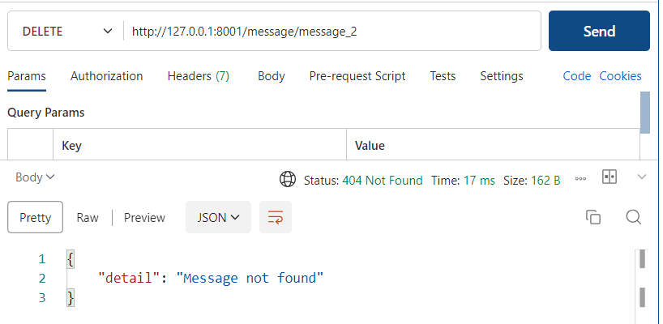

### PATCH API for modifying message_4

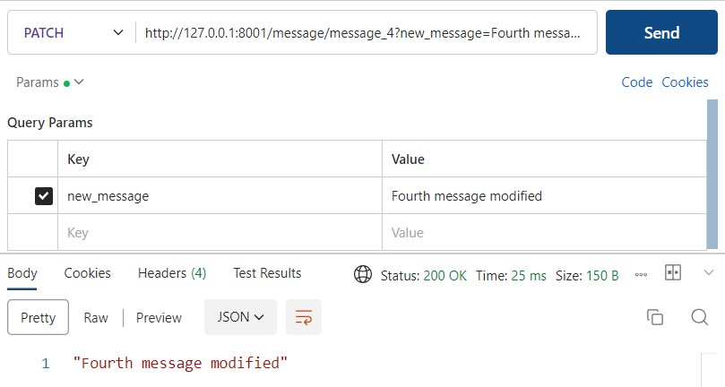

### GET all API to view PATCH & DELETE API from previous steps

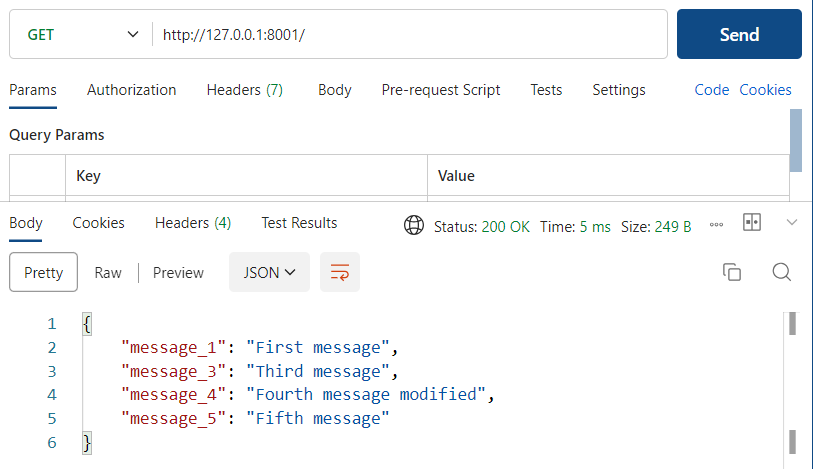

### POST API for adding a message

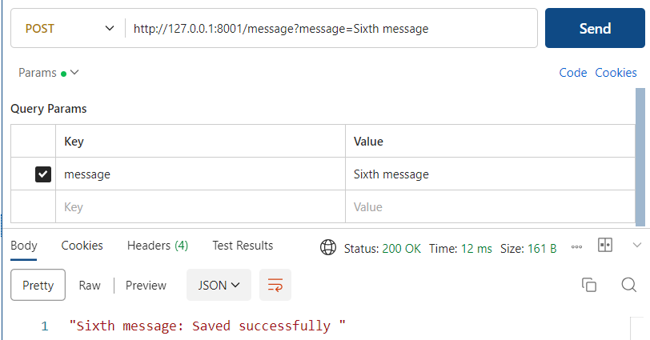

### GET all API to check the message added in previously deleted space

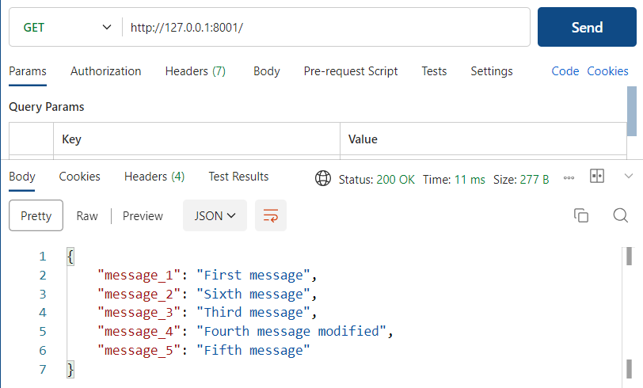

### POST API for adding a message

### GET all API to check the message added

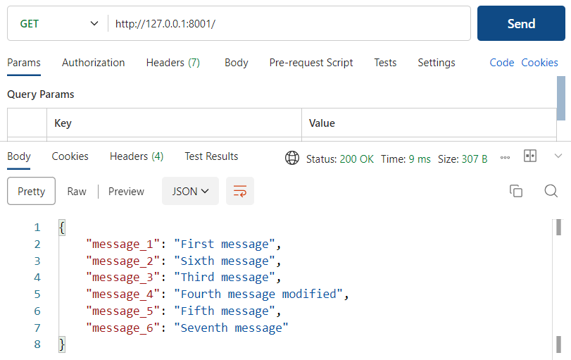

### GET API to check the message that is not in Dict messages

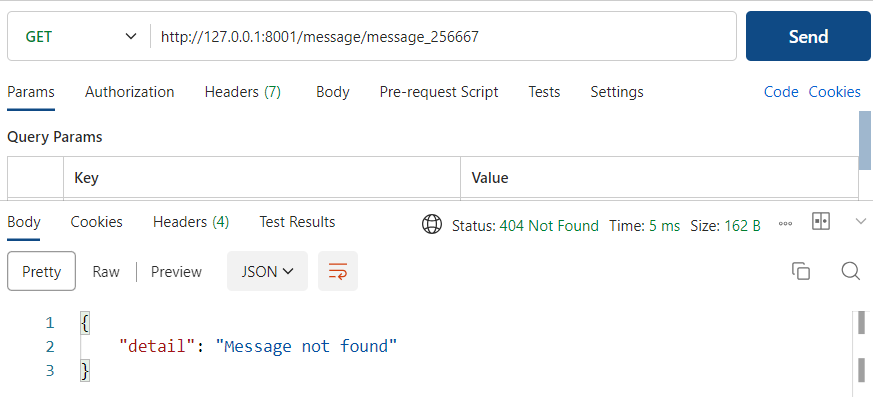
