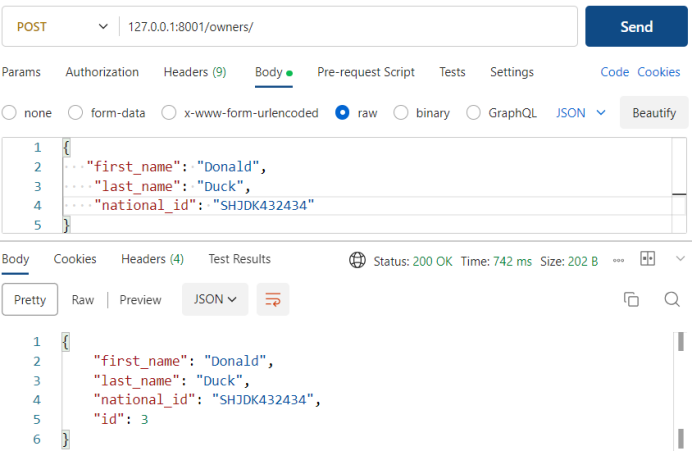
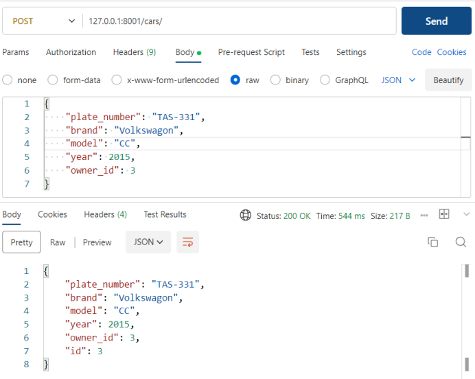
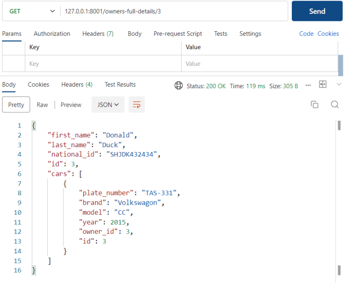
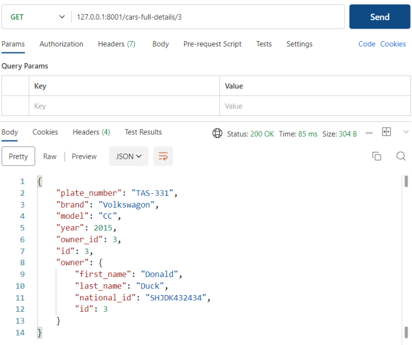
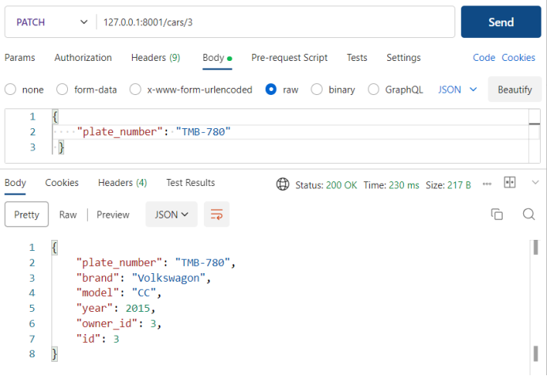
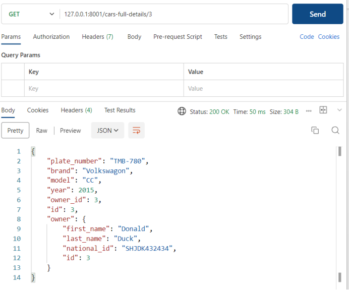

# Screen shots of Postman Results

### POST API for adding a owner to Owners table

### POST API for adding a car to Cars table

### GET API for Full Owner Details based on owner_id

### GET API for Full Car Details based on car_id

### PATCH API to change plate_number based on car_id

### GET API for Full Car Full Details based on car_id after changing plate_number using PATCHH API

